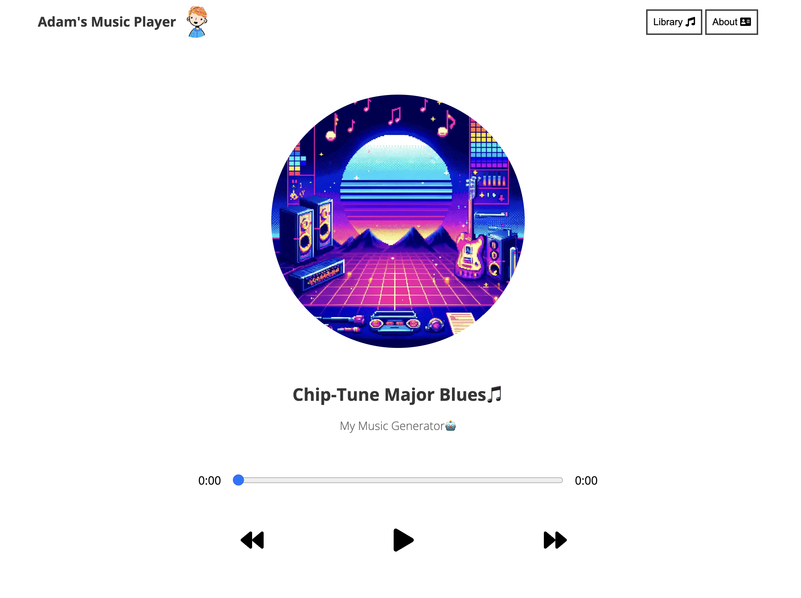

# music-player



A simple music player for my website, written in JavaScript + React using Gatsby!

I made this project mainly to showcase [my music generation library](https://github.com/adam-mcdaniel/music-generation), which sounds pretty good! I also wanted to a music player that was simple and easy to use, and that could be easily integrated into my website.

## Usage

To use this music player, you'll need to have a Gatsby site set up. You can then install this package using npm:

```bash
$ npm install --legacy-peer-deps
```

To run the music player, use the bash scripts in the root directory.
- `build.sh` will build the music player.
- `develop.sh` will start a continuously updated instance of the music player on `localhost:8000`.
- `serve.sh` will serve the music player on `localhost:9000`.

The reason for the bash scripts is that it requires an OpenSSL legacy provider -- you can run the `npm` commands directly with the following variable set:

```bash
$ export NODE_OPTIONS=--openssl-legacy-provider
```

## Adding Music

To add music, go into `gatsby-config.js` and add your song information to the `songData` array. Each song should have the following fields:

- `title`: The title of the song.
- `artist`: The artist of the song.
- `cover`: The cover image of the song.
- `audio`: The audio file of the song.
- `id`: The id of the song. **This should be unique!**
- `active`: Whether the song is active or not when the player starts. **Only one song should be active!**

## License

This project is licensed under the MIT License - see the [LICENSE](LICENSE) file for details.